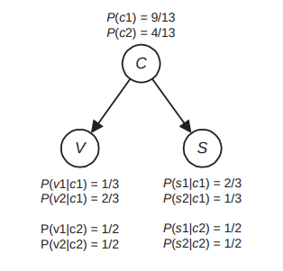

# Instancing a Bayesian Network

## Example 1 - Simple Bayesian Network



```julia 
# Node C
node_C = DiscreteNode("C", ["c1", "c2"])
set_parameters!(node_C, sparse([9/13 4/13]))

# Node V
node_V = DiscreteNode("V", ["v1", "v2"])
add_parent!(node_V, node_C)
set_parameters!(node_V, sparse([[1/3 2/3]; [1/2 1/2]]))

# Node S
node_S = DiscreteNode("S", ["s1", "s2"])
add_parent!(node_S, node_C)
set_parameters!(node_S, sparse([[2/3 1/3]; [1/2 1/2]]))
```

## Example 2 - Parameters Learning

```julia
node_H = DiscreteNode("H", ["T", "F"])

node_S = DiscreteNode("S", ["T", "F"])
add_parent!(node_S, node_H)

node_E = DiscreteNode("E", ["T", "F"])
add_parent!(node_E, node_H)

df = DataFrame("H" => ["T", "T", "F", "F", "T", "T", "F", "T", "T", "F", "T", "T", "T", "T", "T", "T"],
               "S" => ["F", "F", "T", "F", "F", "F", "F", "F", "F", "F", "F", "T", "F", "T", "F", "F"],
               "E" => ["T", "T", "F", "T", "F", "T", "F", "T", "T", "T", "T", "T", "T", "T", "T", "T"])

estimator = MaximumLikelihoodEstimator(df, BayesianNetwork([node_H, node_S, node_E], [(node_H, node_S), (node_H, node_E)]))
estimate(estimator)
```

## References
- Darwiche, A. Modeling and Reasoning with Bayesian Networks
- Neapolitan, R. Learning Bayesian Networks